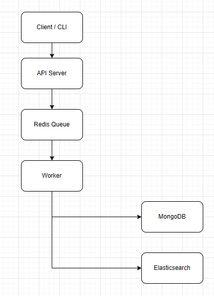

# Eventory
Eventory is a personal knowledge and activity tracker designed as a backend-focused side project.

The goal of this project is to record daily learning activities, notes, LeetCode practice, and future activities as events, then provide search and analytics features similar to a small log analytics system.

## Project Motivation
I built this project to practice backend engineering concepts used in production systems, including API design, event-driven architecture, asynchronous processing, caching, search indexing, and database modeling.

Instead of building a simple CRUD application, this project treats every user action as an event. Events are ingested through an API, processed asynchronously through a Redis queue, stored in MongoDB as the source of truth, and indexed into Elasticsearch for full-text search.

## Core Features
- Event ingestion API
- Asynchronous event processing with Redis queue
- MongoDB event storage
- Elasticsearch full-text search
- Redis cache for frequently accessed queries
- Analytics for daily activity and top tags
- CLI tool for adding events from the terminal
- Docker-based local development environment
- GitHub Actions for testing and Docker image build

## Architecture



## Event Types

The system treats each record as an event. Each event belongs to one of the following types:

| Type | Description | Example |
| --- | --- | --- |
| learning | Knowledge, concepts, or technical notes I learned | Learned Redis TTL and cache-aside pattern |
| note | Reminders, todos, or quick notes | Prepare backend interview questions |
| leetcode | Coding practice records | Solved Two Sum using hash map |
| activity | Future activities, plans, or scheduled events | Attend backend system design meetup |

Example event:

```json
{
  "type": "learning",
  "title": "Learn Redis TTL",
  "content": "Studied how Redis expiration works and how TTL can be used in cache-aside patterns.",
  "tags": ["backend", "redis", "cache"],
  "timestamp": "2026-04-13T10:00:00.000Z"
}
```

# Tech Stack
- Node.js
- TypeScript
- Express
- MongoDB
- Elasticsearch
- Redis
- Docker
- Github Actions

# Backend Concepts Practiced
This project is designed to practice the following backend concepts:

- MVC architecture
- Clean architecture
- Dependency injection
- Repository pattern
- Event-driven architecture
- Queue-based asynchronous processing
- Cache-aside pattern
- MongoDB document modeling
- Elasticsearch indexing and search
- Dockerized development environment
- CI/CD basics

## Project Scope
The first version focuses on backend architecture and system design rather than frontend UI. The main user interfaces will be REST APIs and a CLI tool.

## Development Plan
### Phase 1: Synchronous MVC (Day 1 ~ Day 3)
- Define project requirements
- Design API contracts
- Design MongoDB schema
- Controller → Service → MongoDB (Phase 1)

The first implementation uses a simple synchronous MVC flow.

```text
Client
  → Express Route
  → Controller
  → Service
  → Repository
  → MongoDB
```
### ### Phase 2: Event-Driven Architecture
- Add request validation and error handling
- Implemented Express MVC structure
- Implemented MongoDB event persistence
- Implemented POST /events synchronous ingestion
- Refactored POST /events into Redis Queue based asynchronous ingestion
- Implemented BullMQ worker to consume events and store them in MongoDB
- Verify retry and backoff behavior

The next phase will refactor event ingestion into an asynchronous flow.

```text
Client / CLI
  → API Server
  → Redis Queue
  → Worker
  → MongoDB
  → Elasticsearch
```

### Day 
- Implement worker
- Store events in MongoDB
- Index events into Elasticsearch
- Add retry handling
### Day 
- Implement search API
- Implement analytics API
- Add Redis cache-aside pattern
### Day 
- Implement CLI tool
- Add Docker Compose
- Add tests
- Add GitHub Actions
- Polish README and documentation

## Design Decisions
### Why MongoDB?


### Why Elasticsearch?


### Why Redis?
