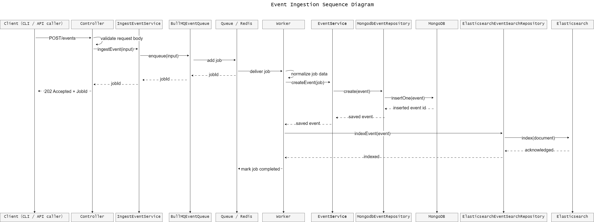
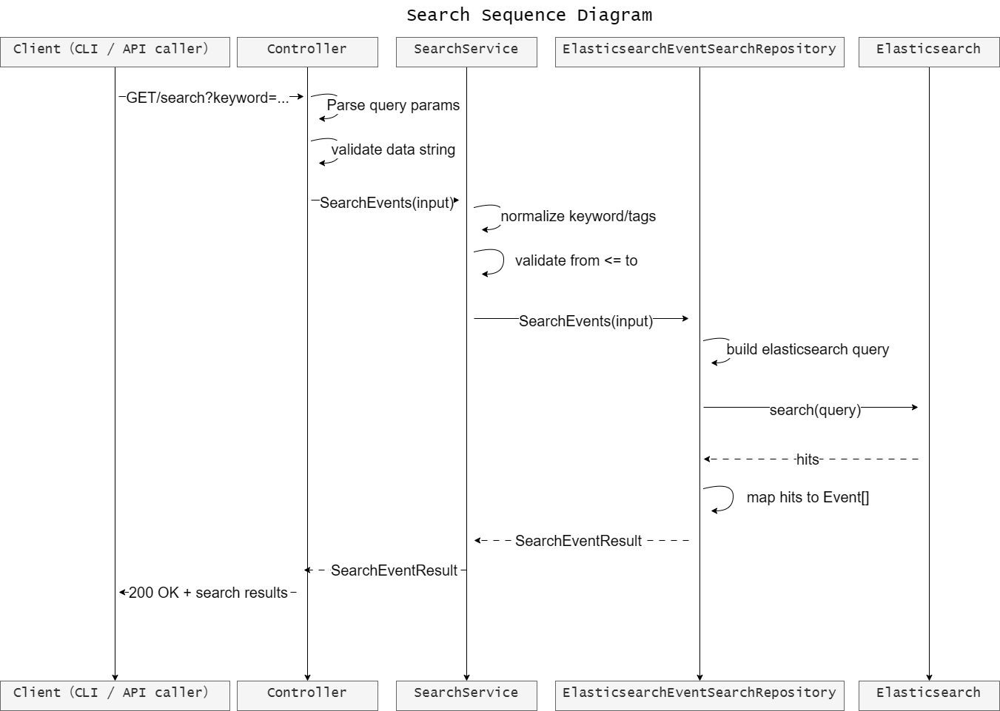
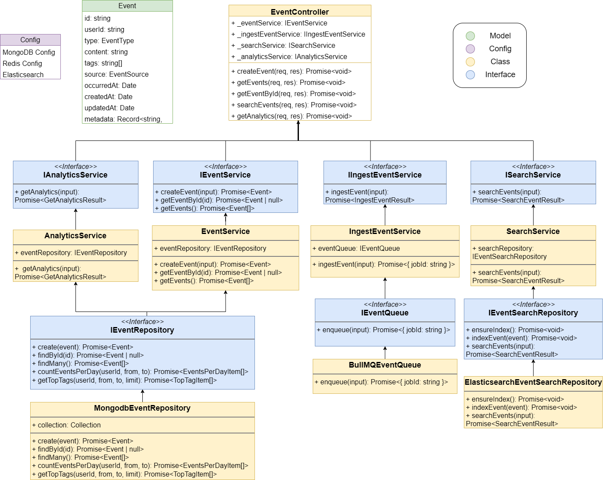

# Eventory
Eventory is a personal knowledge and activity tracker designed as a backend-focused side project.

The goal of this project is to record daily learning activities, notes, LeetCode practice, and future activities as events, then provide search and analytics features similar to a small log analytics system.

## Project Motivation
I built this project to practice backend engineering concepts used in production systems, including API design, event-driven architecture, asynchronous processing, caching, search indexing, and database modeling.

Instead of building a simple CRUD application, this project treats every user action as an event. Events are ingested through an API, processed asynchronously through a Redis queue, stored in MongoDB as the source of truth, and indexed into Elasticsearch for full-text search.

## Core Features
- Event ingestion API
- Asynchronous event processing with Redis queue
- MongoDB event storage
- Elasticsearch full-text search
- Redis cache for frequently accessed queries
- Analytics for daily activity and top tags
- CLI tool for adding events from the terminal
- Docker-based local development environment
- Docker Compose production deployment topology
- Caddy reverse proxy for the public web entrypoint
- GCP Compute Engine portfolio/demo deployment
- GitHub Actions CI/CD for automated testing, build, and VM deployment

## Architecture


## Production Deployment
Eventory is deployed as a portfolio/demo system on Google Cloud Platform using a single Compute Engine VM, Docker Compose, and Caddy.

```text
Internet
  -> GCP Firewall
  -> Ubuntu UFW
  -> Caddy
  -> Eventory API / Frontend
  -> Redis Queue
  -> Worker
  -> MongoDB + Elasticsearch
```

Only Caddy exposes public ports `80` and `443`. MongoDB, Redis, Elasticsearch, the API container, and the worker container communicate through the internal Docker network.

## Deployment Stack
- GCP Compute Engine for VM hosting
- Docker Compose for multi-service orchestration
- Caddy for reverse proxy and future HTTPS termination
- MongoDB as source-of-truth storage
- Redis for BullMQ queue processing
- Elasticsearch for full-text indexing and search
- GitHub Actions for CI/CD

## CI/CD Flow
On every push to `main`, GitHub Actions:

1. Installs backend dependencies.
2. Runs backend tests.
3. Builds the TypeScript backend.
4. Installs frontend dependencies.
5. Builds the Vite frontend.
6. Connects to the GCP VM over SSH.
7. Pulls the latest code.
8. Rebuilds and restarts containers with Docker Compose.
9. Runs a health check against `/health`.

This is a first-version CD pipeline designed for a portfolio deployment. A production-grade version would add image registry publishing, deployment approvals, rollback strategy, and stronger observability.

## Production Commands
Start the production stack:

```bash
docker compose -f docker-compose.prod.yml up -d --build
```

Check service status:

```bash
docker compose -f docker-compose.prod.yml ps
```

View logs:

```bash
docker compose -f docker-compose.prod.yml logs --tail=80 app
docker compose -f docker-compose.prod.yml logs --tail=80 worker
docker compose -f docker-compose.prod.yml logs --tail=80 caddy
```

Stop the production stack:

```bash
docker compose -f docker-compose.prod.yml down
```

## Environment Variables
Production uses `.env`, based on `.env.example`:

```env
NODE_ENV=production
PORT=3000
MONGO_URL=mongodb://mongodb:27017
MONGO_DB_NAME=eventory
REDIS_URL=redis://redis:6379
ELASTICSEARCH_URL=http://elasticsearch:9200
```

## Operational Notes
- The VM uses a static external IP so GitHub Actions and DNS can target a stable host.
- GCP firewall and Ubuntu UFW only allow SSH, HTTP, and HTTPS.
- Data services are not exposed to the public internet.
- The worker runs as a separate container from the web/API service.
- The current deployment is intended for portfolio demonstration, not production SaaS usage.


## Sequence Diagram
### Event Ingestion Sequence Diagram


### Search Sequence Diagram


## Class Diagram


## Event Types

The system treats each record as an event. Each event belongs to one of the following types:

| Type | Description | Example |
| --- | --- | --- |
| learning | Knowledge, concepts, or technical notes I learned | Learned Redis TTL and cache-aside pattern |
| note | Reminders, todos, or quick notes | Prepare backend interview questions |
| leetcode | Coding practice records | Solved Two Sum using hash map |
| activity | Future activities, plans, or scheduled events | Attend backend system design meetup |

Example event:

```json
{
  "type": "learning",
  "title": "Learn Redis TTL",
  "content": "Studied how Redis expiration works and how TTL can be used in cache-aside patterns.",
  "tags": ["backend", "redis", "cache"],
  "timestamp": "2026-04-13T10:00:00.000Z"
}
```

# Tech Stack
- Node.js
- TypeScript
- Express
- MongoDB
- Elasticsearch
- Redis
- Docker
- Github Actions

# Backend Concepts Practiced
This project is designed to practice the following backend concepts:

- MVC architecture
- Clean architecture
- Dependency injection
- Repository pattern
- Event-driven architecture
- Queue-based asynchronous processing
- Cache-aside pattern
- MongoDB document modeling
- Elasticsearch indexing and search
- Dockerized development environment
- CI/CD basics

## Project Scope
The first version focuses on backend architecture and system design rather than frontend UI. The main user interfaces will be REST APIs and a CLI tool.

## Development Plan
### Phase 1: Synchronous MVC
- Define project requirements
- Design API contracts
- Design MongoDB schema
- Controller → Service → MongoDB (Phase 1)

The first implementation uses a simple synchronous MVC flow.

```text
Client
  → Express Route
  → Controller
  → Service
  → Repository
  → MongoDB
```
### Phase 2: Event-Driven Architecture
- Add request validation and error handling
- Implemented Express MVC structure
- Implemented MongoDB event persistence
- Implemented POST /events synchronous ingestion
- Refactored POST /events into Redis Queue based asynchronous ingestion
- Implemented BullMQ worker to consume events and store them in MongoDB
- Verify retry and backoff behavior
- Implement worker
- Store events in MongoDB
- Index events into Elasticsearch
- Add retry handling
- Implemented GET / search by using Elasticsearch
- Implemented GET / analytics API

The phase will refactor event ingestion into an asynchronous flow.

```text
Client / CLI
  → API Server
  → Redis Queue
  → Worker
  → MongoDB
  → Elasticsearch
```
###  Phase 3: Production Readiness & Tooling
- Implement CLI tool
- Add Docker Compose
- Add tests
- Add GitHub Actions
- Polish README and documentation

```text
Client / CLI
  → API Server
  → Redis Queue
  → Worker
  → MongoDB
  → Elasticsearch
```
